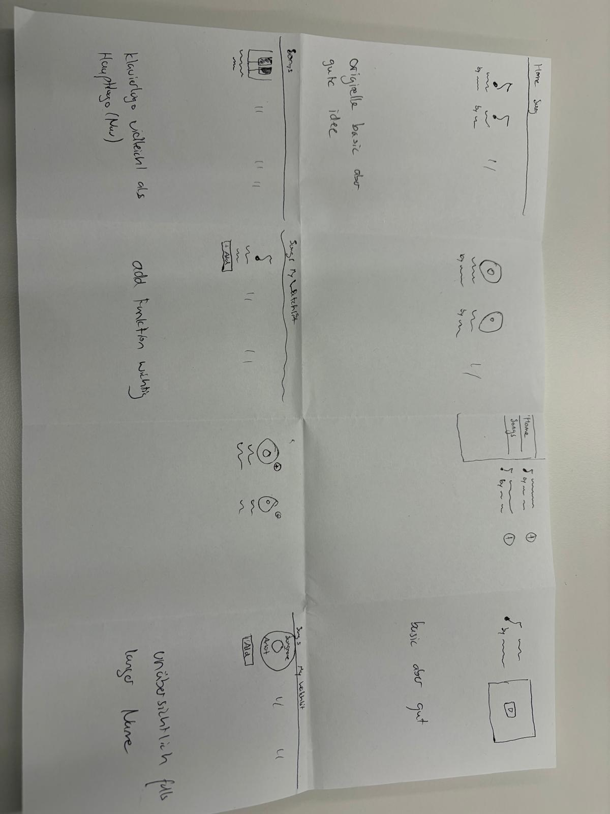
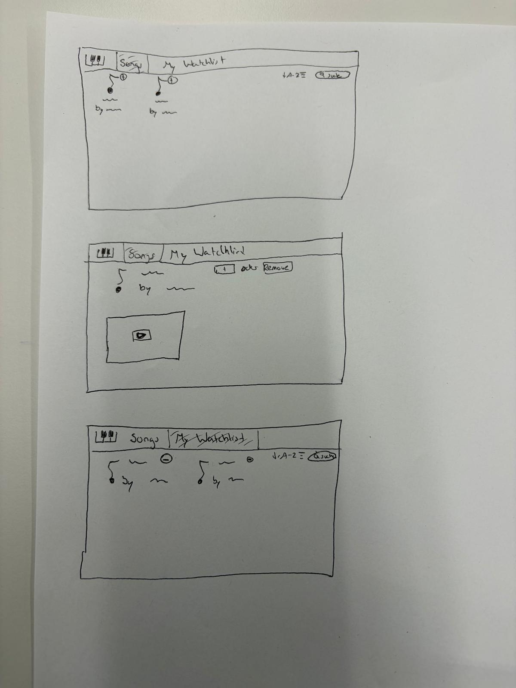
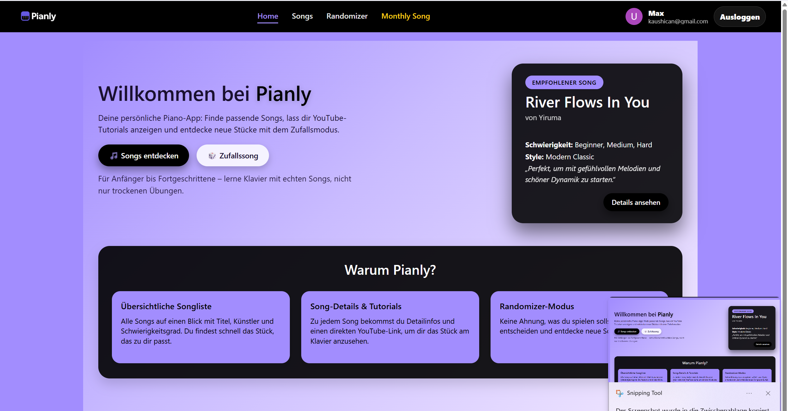
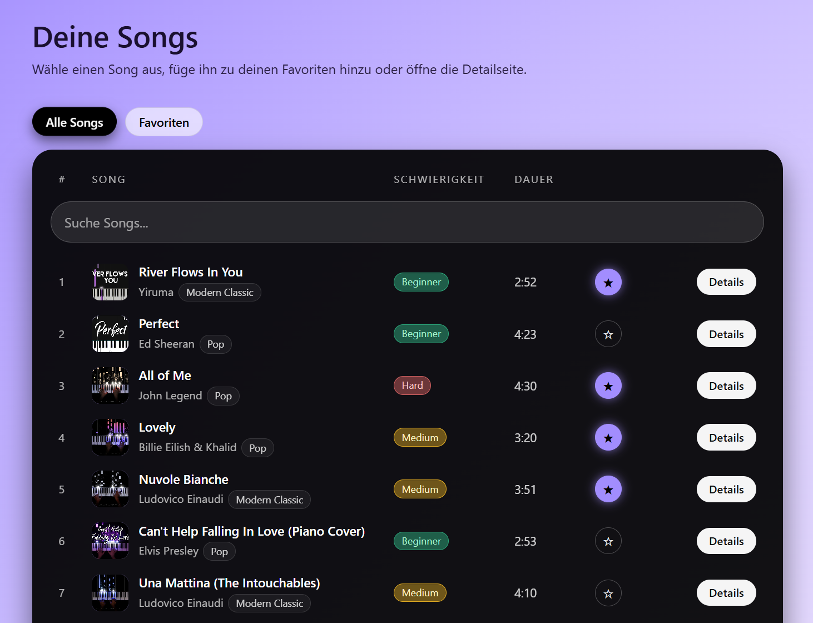
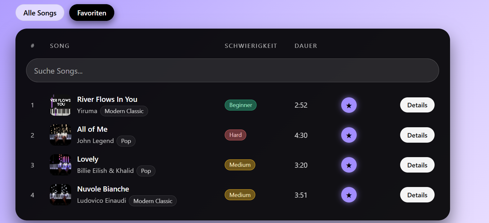
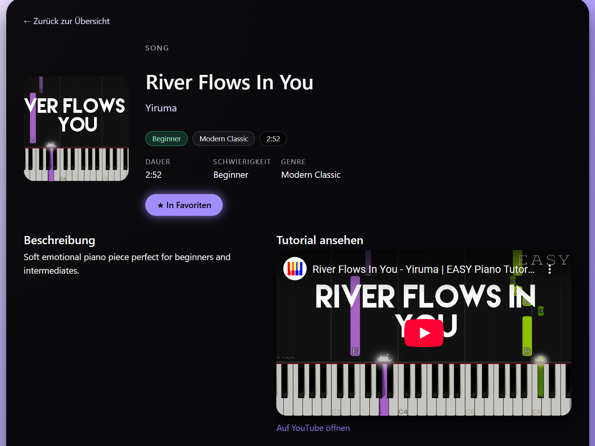
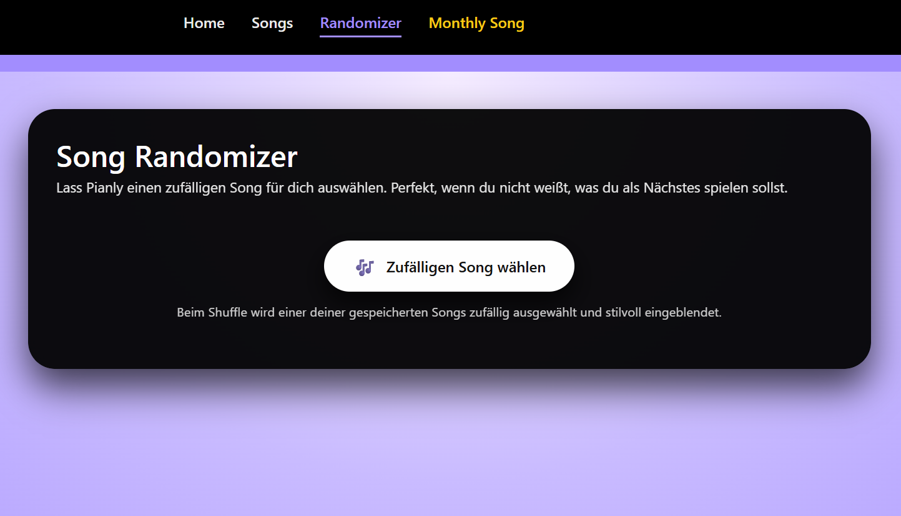
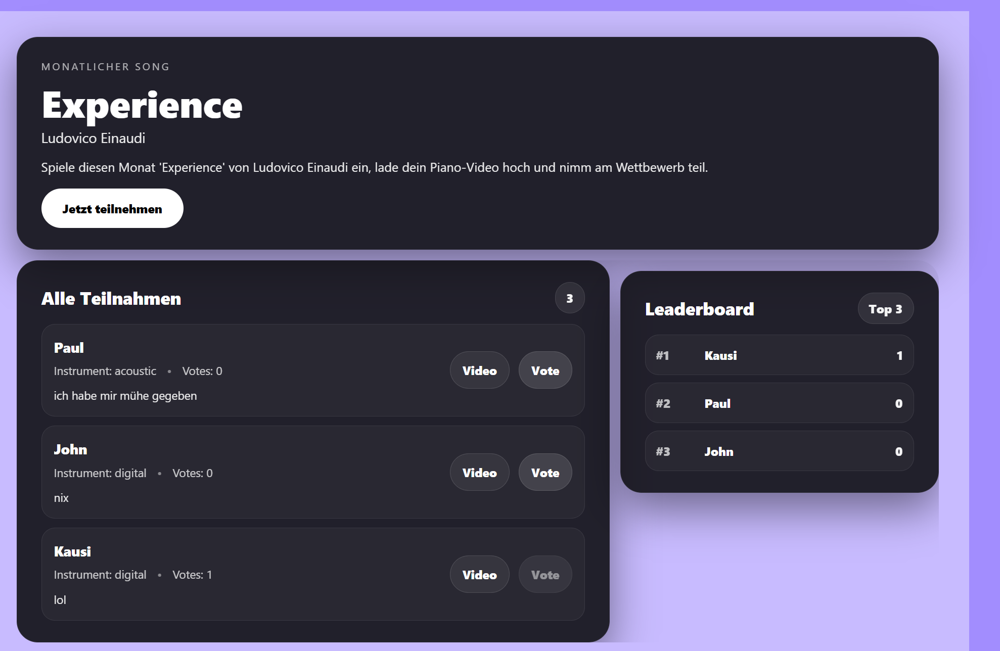
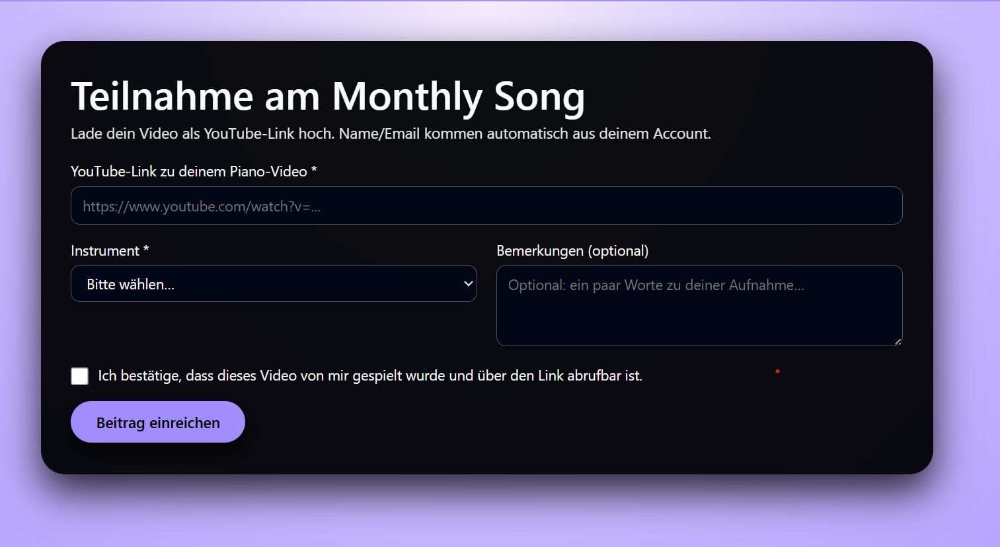

# Projektdokumentation – Pianly

## Inhaltsverzeichnis

1. [Einordnung & Zielsetzung](#1-einordnung--zielsetzung)
2. [Zielgruppe & Stakeholder](#2-zielgruppe--stakeholder)
3. [Anforderungen & Umfang](#3-anforderungen--umfang)
4. [Vorgehen & Artefakte](#4-vorgehen--artefakte)
    - [Understand & Define](#41-understand--define)
    - [Sketch](#42-sketch)
    - [Decide](#43-decide)
    - [Prototype](#44-prototype)
    - [Validate](#45-validate)
5. [Erweiterungen [Optional]](#5-erweiterungen-optional)
6. [Projektorganisation [Optional]](#6-projektorganisation-optional)
7. [KI‑Deklaration](#7-ki‑deklaration)
8. [Anhang [Optional]](#8-anhang-optional)

> **Hinweis:** Massgeblich sind die im **Unterricht** und auf **Moodle** kommunizierten Anforderungen.

<!-- WICHTIG: DIE KAPITELSTRUKTUR DARF NICHT VERÄNDERT WERDEN! -->

<!-- Diese Vorlage ist für eine README.md im Repository gedacht. Abschnitte mit [Optional] können weggelassen werden, wenn in den Übungen nichts anderes verlangt wird. -->

## 1. Einordnung & Zielsetzung

**Kontext & Problem:**  
Viele Klavierlernende, insbesondere Anfänger und fortgeschrittene Hobbyspieler, möchten gezielt neue Stücke entdecken und üben. Bestehende Plattformen sind oft unübersichtlich, überladen oder trennen Songinformationen, Schwierigkeitsgrad und Übungsmaterial auf mehrere Dienste. Dadurch geht Zeit verloren, und der Fokus auf das eigentliche Üben leidet.

**Ziele:**  
- Entwicklung einer übersichtlichen Web-App zur strukturierten Darstellung von Klavierstücken  
- Zentrale Bündelung relevanter Songinformationen (Titel, Schwierigkeit, Dauer etc.)  
- Direkter Zugang zu passenden Klavier-Lernvideos (YouTube)  
- Möglichkeit, Lieblingsstücke zu markieren und schnell wiederzufinden  
- Klare, reduzierte Benutzeroberfläche mit Fokus auf Usability und Lernfluss  

**Abgrenzung [Optional]:**  
Pianly ist keine vollständige Musik- oder Notenbibliothek. Es gibt keine professionellen Notensätze, keine erweiterten Lernanalysen und kein komplexes Social- oder Kurs-System. Der Fokus liegt bewusst auf Entdecken, Auswählen und Üben von Klavierstücken in einer einfachen, performanten Web-App.

## 2. Zielgruppe & Stakeholder
Wem nützt die Lösung, wer ist beteiligt oder betroffen?

**Primäre Zielgruppe:**  
Klavieranfänger sowie fortgeschrittene Hobbyspieler, die Klavierstücke entdecken, vergleichen und unkompliziert üben möchten. Die Zielgruppe legt Wert auf eine klare Struktur, schnelle Orientierung und direkten Zugang zu Übungsmaterial ohne technische Hürden.

**Weitere Stakeholder [Optional]:**  
- Musiklehrpersonen, die einfache Referenzlisten für Lernende nutzen möchten  
- Lernende im schulischen oder privaten Kontext, die gezielt Stücke auswählen wollen  

**Annahmen [Optional]:**  
- Nutzende möchten möglichst wenige Klicks bis zum eigentlichen Üben  
- Eine visuell reduzierte Oberfläche erleichtert die Orientierung und steigert die Motivation  
- Zusatzfunktionen wie Favoriten oder Sortierung erhöhen den langfristigen Nutzen der Plattform

## 3. Anforderungen & Umfang

Dieses Projekt orientiert sich am Mindestumfang gemäss den Übungen ab Semesterwoche 8. Darüber hinaus wurden zusätzliche Funktionen umgesetzt (siehe Erweiterungen).

### Kernfunktionalität (Mindestumfang)
Der Prototyp ermöglicht das strukturierte Entdecken von Klavierstücken und den direkten Zugriff auf Übungsmaterial:

- **Songliste anzeigen:** Liste von Songs mit zentralen Metadaten (Titel, Artist, Schwierigkeit, Dauer)
- **Songdetail öffnen:** Navigation von der Liste auf eine Detailseite pro Song
- **Songinformationen anzeigen:** Detailansicht mit Beschreibung und Metadaten
- **Tutorial ansehen:** Einbettung eines passenden YouTube-Tutorials pro Song (inkl. Link zu YouTube)
- **Datenpersistenz:** Songdaten werden persistent aus einer MongoDB geladen (serverseitig in SvelteKit)
- **Authentifizierung:** Zugriff auf die Anwendung ist an ein Login via Google gekoppelt (Auth.js)

### Akzeptanzkriterien
- Die Songliste lädt zuverlässig und zeigt alle Songs mit den erwarteten Metadaten an.
- Nutzende können einen Song auswählen und gelangen ohne Fehlermeldung zur entsprechenden Detailseite.
- Das eingebettete YouTube-Tutorial wird korrekt angezeigt und kann abgespielt werden; alternativ kann es über einen Link direkt auf YouTube geöffnet werden.
- Die Anwendung ist stabil bei typischen Interaktionen (Navigation zwischen Seiten, Laden der Daten, wiederholtes Öffnen von Songs).
- Ohne Login wird der Zugriff auf die Kerninhalte eingeschränkt und es wird klar zur Anmeldung aufgefordert.

### Erweiterungen (über den Mindestumfang hinaus)
Folgende Erweiterungen wurden zusätzlich umgesetzt, um den Nutzungskomfort und den „Entdeckungsfaktor“ zu erhöhen:

- **Favoriten:** Songs können als Favorit markiert und in einer separaten Ansicht angezeigt werden.
- **Tabs/Ansichten:** Umschalten zwischen „Alle Songs“ und „Favoriten“.
- **Suche & Sortierung:** Songliste kann gefiltert (Suche) und sortiert werden (z. B. A–Z / Z–A).
- **Randomizer:** Zufällige Songempfehlung zur Inspiration.
- **Monthly Song Wettbewerb:** Monatlicher Song mit Teilnahme-Flow.
- **Upload/Teilnahme:** Nutzende können einen Beitrag (eigene Piano-Version) erfassen und einreichen.
- **Voting & Leaderboard:** Beiträge können bewertet werden; ein Leaderboard zeigt Top-Platzierungen.
- **UI/Design-Optimierung:** Visuelle Gestaltung und Interaktion wurden über den Mindestumfang hinaus ausgebaut (konsistentes, modernes Interface).

## 4. Vorgehen & Artefakte
Die Durchführung erfolgt phasenbasiert; dokumentieren Sie die wichtigsten Ergebnisse je Phase.

### 4.1 Understand & Define

**Ausgangslage & Ziele:**  
Viele bestehende Musik- und Lernplattformen sind entweder zu allgemein gehalten oder zu komplex für Klavierlernende, die gezielt Stücke üben möchten. Pianly verfolgt das Ziel, den Einstieg in das Üben zu vereinfachen, indem relevante Informationen und Übungsmaterial an einem Ort gebündelt werden.

**Zielgruppenverständnis:**  
Die Zielgruppe erwartet eine einfache, übersichtliche Oberfläche mit schneller Orientierung. Wichtig sind kurze Wege vom Entdecken eines Stücks bis zum tatsächlichen Üben sowie eine klare visuelle Struktur ohne Ablenkung.

**Wesentliche Erkenntnisse:**  
- Wenige, klar definierte Hauptfunktionen erhöhen die Benutzerfreundlichkeit  
- Direkter Zugang zu Lernvideos ist zentral für den Lernprozess  
- Eine reduzierte, konsistente Gestaltung unterstützt Fokus und Motivation  
- Zusatzfunktionen sollten unterstützend sein und den Kernworkflow nicht stören

### 4.2 Sketch
**Variantenüberblick:**  
In der frühen Entwurfsphase wurden mehrere Layout-Varianten für die zentrale Songseite, die Detailansicht eines Songs sowie die Favoritenansicht skizziert. Ziel war es, unterschiedliche Strukturen und Informationsanordnungen zu vergleichen.

**Skizzen:**  
Es wurden mehrere Skizzen erstellt, die sich insbesondere in folgenden Punkten unterschieden:
- Anordnung der Songliste (kompakt vs. großzügig)  
- Platzierung von Such- und Filterelementen  
- Darstellung der Detailinformationen (Text-lastig vs. visuell)  
- Position und Größe des eingebetteten YouTube-Videos  
- Zugriff auf Favoriten (eigene Seite vs. Tab-Ansicht)

Die Skizzen dienten als Grundlage, um Vor- und Nachteile der jeweiligen Varianten zu bewerten und eine geeignete Struktur für den Prototypen auszuwählen.

**Abbildung 1:** Crazy 8s 

**Abbildung 2:** mehrere Skizzen

### 4.3 Decide
- **Gewählte Variante & Begründung:** _[Entscheidkriterien nennen]_  
- **End‑to‑End‑Ablauf:** _[kurz beschreiben]_  
- **Referenz‑Mockup:** _[URL, Screenshots mit kurzen Beschreibungen]_  

**Gewählte Variante & Begründung:**  
Basierend auf den Skizzen wurde eine Variante mit klarer, vertikaler Struktur gewählt. Die Songliste steht im Mittelpunkt und ermöglicht einen schnellen Überblick, während Detailinformationen auf einer separaten Seite dargestellt werden. Diese Lösung bietet die beste Balance zwischen Übersichtlichkeit und Informationsdichte.

**End-to-End-Ablauf:**  
Startseite mit Songliste öffnen → Song auswählen → Detailseite mit Informationen und Video anzeigen → optional Song als Favorit markieren → zwischen allen Songs und Favoriten wechseln.

**Referenz-Mockup:**  
Figma-Mockup der finalen Struktur und des visuellen Konzepts.  
https://www.figma.com/design/YtCXNz8l3CTi0Sq7svYEQf/Pianly?node-id=0-1&t=8xoZD6S8jsvQKNEO-1

### 4.4 Prototype
**Kernfunktionalität:**  
- Anzeige einer Songliste mit relevanten Metadaten  
- Navigation von der Songliste zur jeweiligen Song-Detailseite  
- Darstellung detaillierter Songinformationen inklusive eingebettetem YouTube-Tutorial  
- Markieren von Songs als Favoriten und erneuter Zugriff über eine separate Ansicht  
- Authentifizierung via Google Login mit eingeschränktem Zugriff für nicht angemeldete Nutzende  

**Erweiterte Funktionalität (im Prototyp umgesetzt):**  
- **Randomizer:** Zufällige Songempfehlung zur Inspiration  
- **Monthly Song:** Monatlich wechselnder Song als Wettbewerb  
- **Teilnahme:** Angemeldete Nutzende können eine eigene Piano-Version zu diesem Song einreichen  
- **Voting:** Beiträge können bewertet werden  
- **Leaderboard:** Übersicht der bestbewerteten Beiträge 

**Deployment:**
https://pianly.netlify.app/

#### 4.4.1 Entwurf (Design)

**Informationsarchitektur:**  
Die Anwendung ist in klar abgegrenzte Hauptbereiche unterteilt:  
Startseite mit Songliste → Song-Detailseite mit Informationen und Video → Favoritenansicht → Randomizer → Monthly Song mit Teilnahme-, Voting- und Leaderboard-Ansicht.  
Die Navigation ist bewusst reduziert gehalten, um den Fokus auf den Kernworkflow (Song entdecken und üben) zu legen.

**Oberflächenentwürfe:**  
Der Prototyp verwendet eine listenbasierte Darstellung der Songs mit klarer visueller Hierarchie. Zentrale Informationen sind direkt sichtbar, während weiterführende Inhalte auf Detailseiten ausgelagert sind. Interaktive Elemente wie Favoriten, Teilnahme oder Voting sind visuell hervorgehoben.

**Abbildung 1:** Homepage

**Abbildung 2:** Songliste

**Abbildung 3:** Favoriten

**Abbildung 4:** Songdetails

**Abbildung 5:** Randomizer

**Abbildung 6:** Monthly Song

**Abbildung 7:** Anmeldeformular

**Designentscheidungen:**  
- Reduziertes, modernes Interface zur Minimierung visueller Ablenkung  
- Konsistente Typografie und Abstände für bessere Lesbarkeit  
- Klare visuelle Trennung zwischen Informations- und Interaktionsbereichen  
- Fokus auf einfache, selbsterklärende Interaktionen  

#### 4.4.2 Umsetzung (Technik)

**Technologie-Stack:**  
SvelteKit mit Svelte 5 (Runes Mode), Node.js, MongoDB sowie Auth.js für Google-basierte Authentifizierung. Vite wird für lokale Entwicklung und Build-Prozesse verwendet.

**Tooling:**  
Visual Studio Code als Entwicklungsumgebung, Git und GitHub zur Versionsverwaltung sowie Browser-Entwicklertools zur Fehlersuche und Optimierung.

**Struktur & Komponenten:**  
- `/songs` – Übersicht der Songliste  
- `/songs/[id]` – Detailseite eines Songs  
- `/randomizer` – Zufällige Songempfehlung  
- `/monthly-song` – Wettbewerbsansicht mit Beiträgen  
- Wiederverwendbare Komponenten für Song-Items, Favoritenstatus, Voting und Sortierung  
- State-Management mit Svelte 5 Runes (`$state`, `$derived`)

**Daten & Schnittstellen:**  
Songdaten sowie Wettbewerbsbeiträge werden aus einer MongoDB-Collection geladen und serverseitig über SvelteKit-Routen bereitgestellt.

**Besondere Entscheidungen:**  
Der Einsatz von Svelte 5 Runes Mode ermöglicht eine klare und performante State-Verwaltung ohne externe Stores. Die Authentifizierung wurde bewusst auf Google Login beschränkt, um die Komplexität gering zu halten und die Einstiegshürde für Nutzende zu minimieren.

### 4.5 Validate

**URL der getesteten Version:**  
https://pianly.netlify.app/

**Ziele der Prüfung:**  
Ziel der Usability-Evaluation war es zu überprüfen,
- ob der Einstieg in die Anwendung (Login) verständlich ist,
- ob Nutzende die Songliste intuitiv erfassen können,
- ob der Wechsel zwischen Songliste, Detailseite und Favoriten nachvollziehbar ist,
- und ob die Favoriten-Funktion ohne zusätzliche Erklärung genutzt werden kann.

**Vorgehen:**  
Die Evaluation wurde als unmoderierter, szenario-basierter Kurztest durchgeführt.  
Die Tests fanden remote statt. Die Testpersonen erhielten die Aufgaben in schriftlicher Form und wurden gebeten, während der Bearbeitung laut zu denken.

**Stichprobe:**  
Es wurden drei Testpersonen einbezogen:
- zwei Mitschüler aus der Klasse
- eine musikinteressierte Person ohne formale Klavierausbildung.  
Alle Testpersonen verfügen über grundlegende Erfahrung im Umgang mit Web-Anwendungen.

**Aufgaben / Szenarien:**  
1. Öffne die Anwendung und melde dich mit deinem Google-Konto an.  
2. Verschaffe dir einen Überblick über die Songliste und wähle ein Lied aus.  
3. Öffne die Detailseite des Songs und starte das Lernvideo.  
4. Markiere den Song als Favorit.  
5. Wechsle zur Favoritenansicht und öffne den gespeicherten Song erneut.

**Kennzahlen & Beobachtungen:**  
- 3/3 Testpersonen konnten alle Aufgaben erfolgreich abschliessen.  
- Der Login-Prozess wurde von allen Testpersonen sofort verstanden.  
- Die Songliste wurde als übersichtlich und ruhig wahrgenommen.  
- Zwei Testpersonen suchten zunächst nach einer Suchfunktion.  
- Eine Testperson war kurz unsicher, ob ein Song erfolgreich als Favorit gespeichert wurde.

**Zusammenfassung der Resultate:**  
Die Evaluation zeigte, dass der zentrale Workflow (Song finden → Detail ansehen → Favorit speichern) verständlich und stabil funktioniert. Besonders positiv bewertet wurden die reduzierte Oberfläche und der direkte Zugang zu den Lernvideos. Kleinere Unsicherheiten traten bei der Rückmeldung von Interaktionen auf.

**Abgeleitete Verbesserungen:**  
- Visuelle Rückmeldung beim Speichern eines Favoriten verstärken (z. B. deutlicher Statuswechsel).  
- Ergänzung einer Suchfunktion zur schnelleren Orientierung bei grösseren Songlisten.  

**Umgesetzte Anpassungen [Optional]:**  
- Die visuelle Hervorhebung des Favoriten-Status wurde nach der Evaluation angepasst, um klarer anzuzeigen, ob ein Song gespeichert ist.  
- Kleinere UI-Anpassungen (Abstände, Kontrast) wurden vorgenommen, um die Lesbarkeit weiter zu verbessern.

## 5. Erweiterungen [Optional]

Über den definierten Mindestumfang hinaus wurden mehrere funktionale und konzeptionelle Erweiterungen umgesetzt. Ziel dieser Erweiterungen war es, den Entdeckungscharakter der Anwendung zu erhöhen, die Motivation zur Nutzung zu steigern und eine stärkere Interaktion zwischen den Nutzenden zu ermöglichen.

### Beschreibung & Nutzen
Die Erweiterungen erweitern den reinen Konsum von Songinformationen um interaktive und spielerische Elemente. Dadurch wird Pianly nicht nur als Nachschlagewerk, sondern als aktive Lern- und Entdeckungsplattform genutzt.

### Umsetzung in Kürze
- **Favoriten-Funktion:** Nutzende können Songs markieren und in einer separaten Ansicht erneut aufrufen, was das langfristige Nutzen der Anwendung unterstützt.
- **Erweiterte Songnavigation:** Tabs sowie Such- und Sortierfunktionen ermöglichen eine schnellere Orientierung innerhalb der Songliste.
- **Randomizer-Modus:** Ein zufälliger Song wird vorgeschlagen, um Inspiration zu bieten, wenn keine konkrete Auswahl vorhanden ist.
- **Monthly Song Wettbewerb:** Ein monatlich wechselnder Song dient als zentrales Thema für einen kleinen Wettbewerb.
- **Teilnahme & Beiträge:** Angemeldete Nutzende können zu diesem Song eine eigene Piano-Version einreichen.
- **Voting-System:** Beiträge können bewertet werden, wodurch ein spielerischer Vergleich entsteht.
- **Leaderboard:** Die besten Beiträge werden übersichtlich dargestellt, um zusätzliche Motivation zu schaffen.
- **Authentifizierungsbasierte Zugriffssteuerung:** Bestimmte Funktionen (z. B. Teilnahme, Voting) sind nur für angemeldete Nutzende verfügbar.

### Abgrenzung zum Mindestumfang
Der Mindestumfang beschränkt sich auf das Entdecken von Songs, das Anzeigen von Detailinformationen sowie das Abspielen von Tutorials. Die oben genannten Erweiterungen sind nicht notwendig, um diesen Kernworkflow zu erfüllen, stellen jedoch zusätzliche Funktionalitäten dar, die den Nutzungskomfort und den Funktionsumfang der Anwendung deutlich erhöhen.
 

## 6. Projektorganisation [Optional]

**Repository & Struktur:**  
Das Projekt wird in einem GitHub-Repository verwaltet. Die Struktur folgt den Konventionen von SvelteKit mit klarer Trennung von Routen, Komponenten und serverseitiger Logik.

**Issue-Management:**  
Für die Organisation der Arbeit wurden einfache To-do-Listen und Issues verwendet, um Features, Verbesserungen und Fehler übersichtlich zu dokumentieren und schrittweise umzusetzen.

**Commit-Praxis:**  
Commits wurden regelmäßig und mit sprechenden Nachrichten erstellt, um Änderungen nachvollziehbar zu halten (z. B. „add favorites tab“, „implement song sorting“, „refactor songs layout“).

## 7. KI‑Deklaration

### **Eingesetzte KI-Werkzeuge**
ChatGPT und CoPilot wurde als unterstützendes KI-Werkzeug verwendet.

### **Zweck & Umfang**
Die KI wurde ausschließlich unterstützend für Design-nahe Aspekte eingesetzt, insbesondere zur Inspiration und Unterstützung bei CSS-Gestaltung, visueller Strukturierung der Benutzeroberfläche sowie bei der Formulierung von Dokumentationstexten. Die Nutzung beschränkte sich auf Vorschläge und Feedback, nicht auf verbindliche Entscheidungen.

### **Art der Beiträge**
- Unterstützung bei der Gestaltung und Optimierung von CSS und Layout  
- Hinweise zur Strukturierung der Benutzeroberfläche  
- Unterstützung bei der sprachlichen Ausformulierung einzelner Dokumentationsabschnitte  

### **Eigene Leistung (Abgrenzung)**
Die gesamte Idee, Konzeption, funktionale Struktur, technische Umsetzung, Datenbankmodellierung sowie alle architektonischen und inhaltlichen Entscheidungen wurden eigenständig erarbeitet. Die KI hatte keinen Einfluss auf die Kernlogik, den Aufbau der Anwendung oder die funktionalen Anforderungen.

### **Reflexion**
Der Einsatz von KI erwies sich als hilfreich zur Beschleunigung von Designentscheidungen und zur Verbesserung der Lesbarkeit der Dokumentation. Gleichzeitig war eine kritische Bewertung aller Vorschläge notwendig, da die Verantwortung für Qualität, Funktionalität und Korrektheit vollständig beim Autor liegt.

## 8. Anhang [Optional]
Beispiele:
- **Testskript & Materialien:**  

### Testskript
Die folgenden Aufgaben wurden im Rahmen der Usability-Evaluation verwendet:
1. Anmeldung mit Google-Konto
2. Auswahl eines Songs aus der Songliste
3. Öffnen der Song-Detailseite und Start des Lernvideos
4. Speichern eines Songs als Favorit
5. Wiederfinden des Songs in der Favoritenansicht

### Beobachtungen (Auszug)
- TP1 suchte zuerst nach einer Suchfunktion.
- TP2 verstand die Favoriten-Funktion ohne Erklärung.
- TP3 war kurz unsicher, ob der Favorit erfolgreich gespeichert wurde.

- **Rohdaten/Auswertung:**  
**Auswertung der Usability-Evaluation**

An der Evaluation nahmen drei Testpersonen teil:
- **TP1 & TP2:** Mitschüler mit Erfahrung im Umgang mit Web-Applikationen  
- **TP3:** Musikinteressierte Person ohne formale Klavierausbildung  

### Beobachtungen pro Testperson

**Testperson 1 (Mitschüler):**
- Fand den Login-Prozess sofort verständlich.
- Orientierte sich schnell in der Songliste.
- Erwartete zunächst eine Suchfunktion, fand den gewünschten Song jedoch auch ohne Probleme.
- Speichern eines Songs als Favorit funktionierte problemlos, der visuelle Status wurde jedoch erst nach kurzem Hinsehen erkannt.

**Testperson 2 (Mitschüler):**
- Navigierte ohne Schwierigkeiten von der Songliste zur Detailseite.
- Verstand die Favoriten-Funktion intuitiv.
- Wechsel zwischen Songliste und Favoritenansicht war nachvollziehbar.
- Äusserte den Wunsch nach zusätzlichen Filtermöglichkeiten bei grösseren Songlisten.

**Testperson 3 (musikinteressierte Person):**
- Benötigte etwas Zeit, um sich einen Überblick über die Songliste zu verschaffen.
- Öffnete das Tutorial-Video ohne Schwierigkeiten.
- War kurz unsicher, ob ein Song erfolgreich als Favorit gespeichert wurde.
- Bewertete die Anwendung insgesamt als übersichtlich und ruhig gestaltet.

### Identifizierte Usability-Probleme
- Fehlende Suchfunktion wurde von zwei Testpersonen erwartet (mittleres Usability-Problem).
- Der Status eines gespeicherten Favoriten war nicht für alle Testpersonen sofort eindeutig erkennbar (kleines Usability-Problem).

### Zusammenfassende Erkenntnisse
Der grundlegende Workflow (Anmeldung → Song auswählen → Detailseite → Favorit speichern) konnte von allen Testpersonen erfolgreich durchgeführt werden. Die Anwendung wurde als übersichtlich und verständlich wahrgenommen. Kleinere Unsicherheiten betrafen vor allem Rückmeldungen zu Interaktionen und erwartete Zusatzfunktionen.

---

<!-- Prüfliste (nicht abgeben, nur intern nutzen) -->
<!--
[ ] Kernfunktionalität gemäss Übungen umgesetzt (Workflows durchgängig)
[ ] Akzeptanzkriterien formuliert und erfüllt
[ ] Skizzen erstellt (mehrere Varianten, Unterschiede dokumentiert)
[ ] Referenz‑Mockup in Decide verlinkt (URL/Screenshots)
[ ] Deployment erreichbar
[ ] Umsetzung (Technik) vollständig (Technologie‑Stack; Tooling & KI‑Einsatz inkl. Überlegungen; Struktur/Komponenten; Daten/Schnittstellen falls genutzt)
[ ] Evaluation durchgeführt; Ergebnisse dokumentiert; Verbesserungen abgeleitet
[ ] Dokumentation vollständig, klar strukturiert und konsistent
[ ] KI‑Deklaration ausgefüllt (Werkzeuge; Zweck & Umfang; Art der Beiträge; Abgrenzung; Quellen & Rechte; optional: Prompt‑Vorgehen, Reflexion)
[ ] Erweiterungen (falls vorhanden) begründet und abgegrenzt
[ ] Anhang gepflegt (Testskript/Materialien, Rohdaten/Auswertung) [optional]
-->